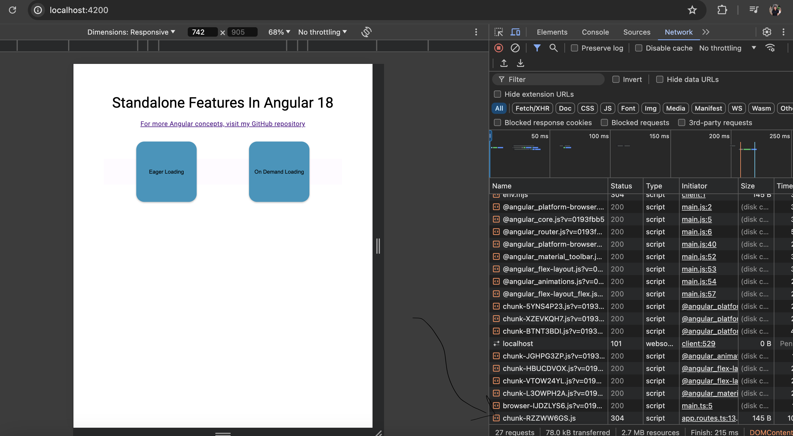

# Standalone Features of Angular 17 & 18

## Standalone components

Standalone components provide a simplified way to build Angular applications. Standalone components, directives, and pipes aim to streamline the authoring experience by reducing the need for NgModules. Existing applications can optionally and incrementally adopt the new standalone style without any breaking changes.

Components, directives, and pipes can now be marked as standalone: true. Angular classes marked as standalone do not need to be declared in an NgModule (the Angular compiler will report an error if you try).

Standalone components specify their dependencies directly instead of getting them through NgModules. 

You can directly add dependent standalone/ngmodule features in imports of standalone component

```typescript
import { Component } from '@angular/core';
import { ImageGridComponent } from './image-grid/image-grid.component';

@Component({
  standalone: true,
  selector: 'photo-gallery',
  // Here ImageGridComponent is another standalone component
  // MatButtonModule is NgModule dependency
  imports: [ImageGridComponent, MatButtonModule],
  template: `
    <image-grid [images]="imageList"></image-grid>
  `,
})
export class PhotoGalleryComponent {
  // component logic
}
```


You can import standalone component in ngModule as well

```typescript
@NgModule({
  declarations: [AlbumComponent],
  exports: [AlbumComponent], 
  //PhotoGallerycomponent is a standalone component used in Ngmodule
  imports: [PhotoGalleryComponent],
})
export class AlbumModule {}
```


# Lazy Loading

## Step 1: Router configuration

To lazy load components/modules, add those in route file as loadChildren (for module) and loadComponent ( for component).

```typescript
export const routes: Routes = [
    {
        path: 'eager-loading',
        component: EagerLoadingComponent
    },
    {
        path: 'on-demand-loading',
        loadComponent: () => import('./on-demand-load/on-demand-load.component').then(m => m.OnDemandLoadComponent)
    }
];
```

## Step 2: App config configuration

Make sure preloading configuration is commented in app.config.ts

```typescript
export const appConfig: ApplicationConfig = {
  providers: [
    provideRouter(routes  
      // ,withPreloading(PreloadAllModules)
    ),
    provideZoneChangeDetection({ eventCoalescing: true }), 
    provideAnimationsAsync()
  ]
};
```
## Step 3: Verify lazy loading

Verify OnDemandLoadComponent js file is loaded only after clicking on-demand button in homepage.

You can verify this in network tab.

After loading the app, clear the network console, before clicking on-demand button and verify a new network call is made to server to retrieve lazyloaded component on demand of user.


# Preloading

## Step 1: Router configuration

To pre load components/modules, add those in route file as loadChildren (for module) and loadComponent ( for component).

```typescript
export const routes: Routes = [
    {
        path: 'eager-loading',
        component: EagerLoadingComponent
    },
    {
        path: 'on-demand-loading',
        loadComponent: () => import('./on-demand-load/on-demand-load.component').then(m => m.OnDemandLoadComponent)
    }
];
```

## Step 2: App config configuration

Make sure preloading configuration is uncommented in app.config.ts

```typescript
export const appConfig: ApplicationConfig = {
  providers: [
    provideRouter(routes  
       ,withPreloading(PreloadAllModules)
    ),
    provideZoneChangeDetection({ eventCoalescing: true }), 
    provideAnimationsAsync()
  ]
};
```
## Step 3: Verify pre-loading

Ensure that the OnDemandLoadComponent JavaScript file is loaded after all browser JavaScript and CSS files are fully loaded.

Open the browser's Developer Tools (usually by pressing F12 or Ctrl+Shift+I).
Navigate to the Network tab.

Observe the loading sequence of resources. Ensure that the OnDemandLoadComponent JavaScript file is loaded only after all other essential JavaScript and CSS files have been loaded.

Monitor the network activity to verify that a network request for the OnDemandLoadComponent is made to the server once the app is fully available.


Although the application size is small, making the time difference negligible, it is crucial to note that in larger, real-time applications, the proper sequencing and pre-loading of components can have a significant impact on performance and user experience.




